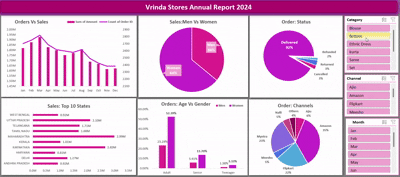

# Vrinda_Store_Sales_Dashboard
# 📊 Vrinda Stores Annual Sales Report 2024

Welcome to the official data analysis repository for **Vrinda Stores Annual Report 2024**. This dashboard provides actionable insights to help Vrinda Stores understand its customer behavior and grow sales in 2025.

---

## 🧾 Full Dashboard Overview

> 🎞️ Live Dashboard Preview  

---

## 🔍 Key Business Questions & Insights

### 1. 📈 Compare Sales and Orders
- **Insight:** March recorded the **highest sales and orders**.
- **Trend:** Sales were strong from January–March, dipped slightly mid-year, and dropped in the last quarter.

---

### 2. 🗓️ Which Month Got the Highest Sales and Orders?
- **Insight:** **March** had peak performance in both sales amount and number of orders.

---

### 3. 🧑‍🤝‍🧑 Who Purchased More – Men or Women?
- **Insight:** **Women (64%)** made more purchases than Men (36%).

---

### 4. 📦 What Are the Order Status Types?
- Delivered: 92%  
- Returned: 3%  
- Cancelled: 3%  
- Refunded: 2%

---

### 5. 🏙️ Top 10 States Contributing to Sales
- **Maharashtra**: 2.99M  
- **Karnataka**: 2.65M  
- **Uttar Pradesh**: 2.10M  
- Others: Telangana, Tamil Nadu, Kerala, Delhi, Andhra Pradesh, etc.

---

### 6. 👨‍👩‍👧‍👦 Relation Between Age and Gender (Orders)
- **Adult Women** are the largest buying segment (52.39%).
- Minimal orders came from teenagers.

---

### 7. 🌐 Which Channel Contributes the Most?
- **Amazon** leads with 35%, followed by **Myntra** (23%) and **Flipkart** (22%).

---

### 8. 🛍️ Highest Selling Category
- To be explored using **interactive category slicer** on the dashboard.

---

## 🧠 Summary of Insights

- 📅 Focus Months: March and February
- 🧍‍♀️ Buyer Persona: Adult Women
- 🌎 Key States: Maharashtra, Karnataka, Uttar Pradesh
- 🛒 Best Channels: Amazon, Myntra, Flipkart
- ✅ Operational Efficiency: 92% orders delivered successfully

---

## 📁 Files in this Repository

- `vrinda_store_analysis_xlsx` - Dataset
- `Vrinda_Store_Sales_Dashboard_Screenshot.png` – Static dashboard snapshot  
- `vrinda_dashboard.gif` – Animated dashboard preview  
- `README.md` – This documentation

---

## 🛠️ Built Using

- Microsoft Excel (Pivot Charts, Slicers)
- GitHub (Project Hosting)

---

## 📬 Contact

For questions, improvements, or business collaborations:  
📧 roshnikumari1192@gmail.com  

---

> “Without data, you're just another person with an opinion.” – *W. Edwards Deming*
